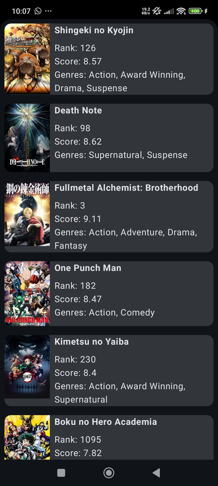
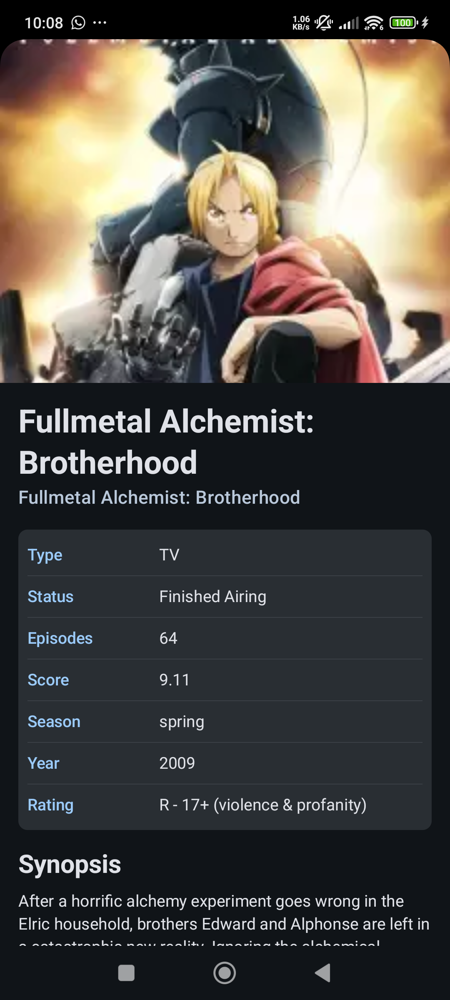

# Anime List Android App

Simple Android App using Jetpack Compose + Room + Hilt + Coil + Retrofit to consume [Jikan API](https://jikan.moe/) to render a list of anime and show details when clicked.

 

## Libs used

- **UI:** [Jetpack Compose](https://developer.android.com/jetpack/compose)
- **Dependency Injection:** [Hilt](https://developer.android.com/training/dependency-injection/hilt-android)
- **Networking:** [Retrofit](https://square.github.io/retrofit/)
- **Local Database:** [Room](https://developer.android.com/training/data-storage/room)
- **Image Loading:** [Coil](https://coil-kt.github.io/coil/)

## Getting Started

### Prerequisites

- Android Studio Ladybug
- JDK 17
- Android SDK 24+

### Running the app

1. Clone the repository:
   ```shell
   git clone https://github.com/uasouz/anime-list-android.git
   ```
2. Open the project in Android Studio.
3. Sync project with Gradle files.
4. Run the `app` module on an emulator or physical device.

Alternatively, you can run using Gradle:
```shell
./gradlew installDebug
```

## Testing

To run the unit tests, use:
```shell
./gradlew test
```

## Architecture and Decisions

For this app I decided to use a simple MVVM setup using the modern Android stack for it.

For the Anime List Screen I used a Flow with Paginated Data that triggers the repository to continuously fetch data from a Room database which is synced with the web API using a remote mediator.

For the Anime Detail Screen it is even simpler using a MutableStateFlow that is manually managed and fetched on the viewModel when the screen is first open: it will hit the database and fetch the anime, in the case that for some reason the anime is not present on the app database it will fetch from Jikan API.

For loading images I went with Coil, so it was easy to keep it composable.

From far the most complex part is the RemoteMediator and the remote keys implementation to keep both the infinite scrolling and the offline first premise I wanted. It required some iterations but got it right.
